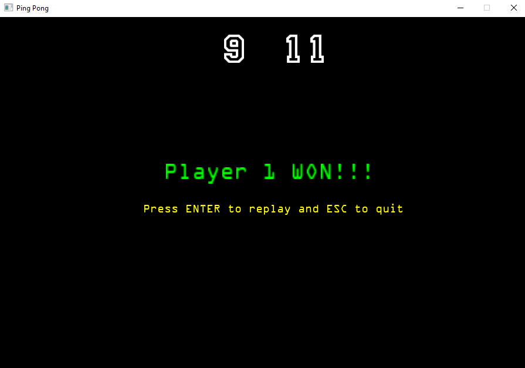

# Ping Pong
Course project for Computer Graphics at Kwame Nkrumah University of Science and Technology. A Ping Pong Game built with OpenGL 3.3 written in C++.

## Features :gem:
   * Two player game :two_men_holding_hands:
   * Different difficulty levels :sweat_smile:
   * Cool soundtrack :smirk:

## Demo :movie_camera:
  
  
  
  

## Contributing :gift: 
Pull requests are welcome. For major changes, please open an issue first to discuss what you would like to change.
Please make sure to update tests as appropriate.

## Want to talk more??
 If you are interested in helping or have something to suggest or just want to chat with me, you can reach me through the following media .
* Email - ebenezergadri99@gmail.com :e-mail:
* Let's connect on <a href="https://www.linkedin.com/in/ebenezer-kweku-gadri-akrong-22b19a185/">LinkedIn.</a> :pushpin:
* I'm on <a href="https://www.hackerrank.com/aiben_">HackerRank</a> too.:relaxed:

